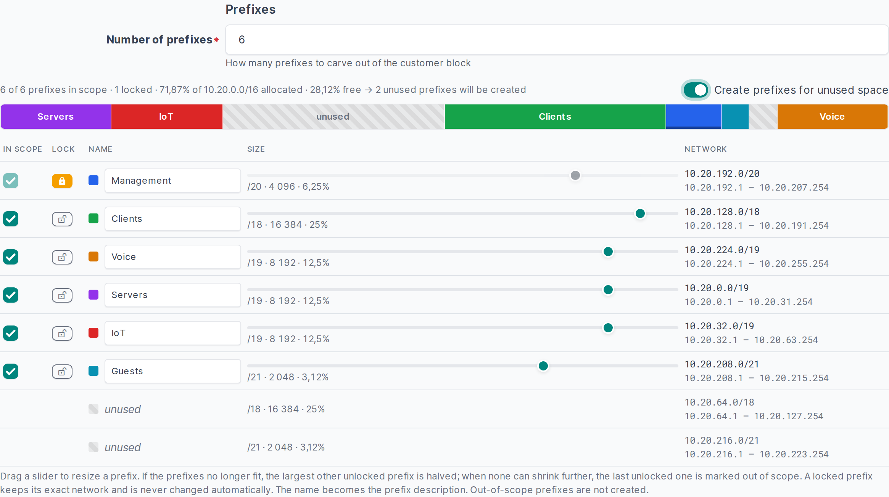

# NetBox plugins

A collection of plugins for [NetBox](https://github.com/netbox-community/netbox). Each plugin lives in its own
directory, is a separate Python package and can be installed on its own.

| Plugin | Description | NetBox |
|---|---|---|
| [Prefix Planner](prefix-planner/) | Plan a tenant's address block with sliders and provision the tenant and its prefixes in one go. Includes a REST API. | 4.7+ |
| [FortiManager Integrator](fortimanager-integrator/) **(beta)** | Create FortiGates as FortiManager model devices from NetBox (blueprint, serial, ADOM from the tenant or an override) push their rendered config as a CLI script, and keep their per-device metadata variables in sync, with checks and readable logs. | 4.7+ |
| [Road Trip](roadtrip/) **(just for fun)** | Drive a car through a city made of your tenants, sites and devices; stop at a building to open its NetBox page. | 4.7+ |

## Screenshots

<table>
  <tr>
    <td width="50%"><a href="prefix-planner/"></a></td>
    <td width="50%"><a href="fortimanager-integrator/"></a></td>
  </tr>
  <tr>
    <td><b>Prefix Planner</b> - size a tenant's prefixes with sliders</td>
    <td><b>FortiManager Integrator</b> (beta) - sync a FortiGate to FortiManager</td>
  </tr>
</table>

## Installing a plugin

Install a released version of a plugin with pip, using the release tag and the plugin's directory as
`subdirectory`:

```bash
source /opt/netbox/venv/bin/activate
pip install "git+https://github.com/vinceneil666/netbox-plugins.git@prefix-planner-v0.5.0#subdirectory=prefix-planner"
```

Leave out `@<tag>` to install the latest code from `main` - that is currently the only way to install the
FortiManager Integrator, which is in beta and has no release yet. Then follow the plugin's own README to enable and
configure it.

## Releases

Each plugin is released on its own. Tags are named `<plugin>-v<version>`, e.g. `prefix-planner-v0.5.0`, and every
[release](https://github.com/vinceneil666/netbox-plugins/releases) has the plugin's wheel and source package
attached.

## License

Apache License 2.0, see [LICENSE](LICENSE).
