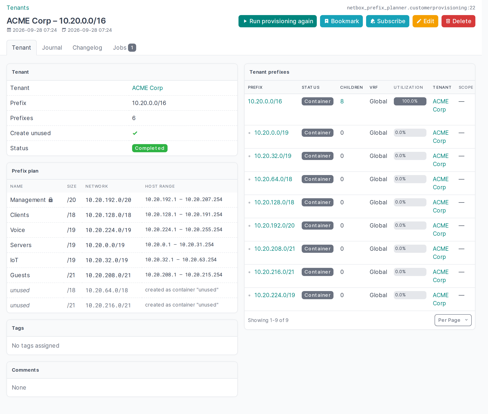

# Prefix Planner

A [NetBox](https://github.com/netbox-community/netbox) plugin for onboarding a tenant's address space in one step.
Pick an existing tenant or name a new one, enter the block assigned to it, size the prefixes with sliders, and
save. A background job creates the tenant (if new), the tenant's container prefix and one container per planned
prefix, all attached to the tenant. Whether a VRF is needed follows NetBox's *Enforce global unique* setting.


## Features

- **Interactive planner**: one slider per prefix, stepping through power-of-two sizes (/19, /20, /21 …). Each row
  shows the CIDR, the usable host range, the address count and its share of the block. A coloured address map
  shows where every prefix sits.
- **Automatic rebalancing**: when a prefix grows and the plan no longer fits, the largest other prefix is
  halved. When nothing can shrink further, the last one is marked *out of scope* and not created. Rows that
  were adjusted flash so you can see what changed.
- **Locks**: lock a prefix to pin it to its exact network. Locked prefixes are never resized, moved or dropped
  automatically; the others are fitted around them.
- **Manual networks**: type a network into the *Network* column (`10.20.64.0/19`, or just `10.20.64.0` to keep
  the current size) to place a prefix yourself. It is locked there automatically and the unlocked prefixes are
  rebalanced around it. Networks outside the block, with host bits set or overlapping another locked prefix are
  rejected with an explanation.
- **Your own names**: every prefix has an editable name, which becomes the prefix description in NetBox.
- **In or out of scope**: switch individual prefixes on or off.
- **Unused space**: optionally create the space no prefix uses as well, as the fewest possible CIDRs, with the
  description `unused`.
- **What you see is what you get**: the browser and the server run the same allocation algorithm, and the server
  re-validates every plan before anything is created.
- **Safe to re-run**: the provisioning job reuses existing objects and never creates duplicates. A
  *Run provisioning again* button and the object's Jobs tab (with the job log) are on the plan's page.
- **Existing or new tenants**: choose a tenant from the list, or keep *Add new tenant* and type a name. A name
  that matches an existing tenant (case-insensitive, or by slug) is rejected, so tenants are never duplicated. A
  tenant can have several plans, e.g. an IPv4 and an IPv6 block.
- **VRF only when needed**: tenants may overlap, even with identical prefixes. With NetBox's *Enforce global
  unique* setting (`ENFORCE_GLOBAL_UNIQUE`) **off**, the prefixes go in the global table. With it **on**, NetBox
  refuses duplicates there, so the job puts the tenant's prefixes in a VRF named after the tenant (reused if it
  exists) and the plan shows a note saying why. The form tells you which applies before you save; the choice is
  stored with the plan, so re-running it later keeps the prefixes where they are.
- **REST API**: full CRUD, a dry-run `preview` endpoint and a `run` endpoint to re-provision (see below).
- IPv4 and IPv6.



## What gets created

For tenant `ACME Corp` with `10.20.0.0/16`:

| Object | Details |
|---|---|
| Tenant | `ACME Corp`, only when *Add new tenant* was chosen |
| VRF | `ACME Corp`, enforce unique, only while *Enforce global unique* is on (reused if it exists) |
| Prefix | `10.20.0.0/16`, status *container*, description `ACME Corp address block` |
| Prefix per planned row | status *container*, description = the row name, e.g. `10.20.128.0/18` → `Clients` |
| Prefix per unused block | only with *Create prefixes for unused space*: status *container*, description `unused` |

All prefixes get the tenant, and go in the tenant's VRF or the global table as described above. Plans provisioned
before 0.4.0 keep the VRF they were created in.

## Requirements

- NetBox 4.7 or later
- Python 3.12 or later

## Installation

Install the latest release (see [Releases](https://github.com/vinceneil666/netbox-plugins/releases)):

```bash
source /opt/netbox/venv/bin/activate
pip install "git+https://github.com/vinceneil666/netbox-plugins.git@prefix-planner-v0.5.0#subdirectory=prefix-planner"
```

or the wheel attached to the release:

```bash
pip install https://github.com/vinceneil666/netbox-plugins/releases/download/prefix-planner-v0.5.0/netbox_prefix_planner-0.5.0-py3-none-any.whl
```

Leave out `@prefix-planner-v0.5.0` to install the latest code from `main` instead.

Enable it in `configuration.py`:

```python
PLUGINS = ["netbox_prefix_planner"]
```

Then apply the migrations and restart NetBox and the background worker (`rqworker`), which runs the
provisioning job:

```bash
cd /opt/netbox/netbox
python manage.py migrate
sudo systemctl restart netbox netbox-rq
```

### netbox-docker

Build an image with the plugin, as described in
[Using NetBox Plugins](https://github.com/netbox-community/netbox-docker/wiki/Using-Netbox-Plugins), for example:

```dockerfile
FROM docker.io/netboxcommunity/netbox:v4.7
RUN /usr/local/bin/uv pip install --python /opt/netbox/venv/bin/python \
      "git+https://github.com/vinceneil666/netbox-plugins.git@prefix-planner-v0.5.0#subdirectory=prefix-planner"
```

Use the image for both the `netbox` and the `netbox-worker` services, and add the plugin to
`configuration/plugins.py`.

The plugin has no settings. (`vrf_per_customer` was removed in 0.4.0 and is ignored.)

## Usage

1. Go to **Plugins → Prefix Planner → Tenants** and click **+**.
2. Choose the **tenant** from the list, or keep **Add new tenant** and type the **new tenant name**. Then enter
   the **prefix** assigned to the tenant.
3. Set the **number of prefixes**. The planner starts with an equal split: 6 prefixes use an 8-way split,
   leaving 2 parts free.
4. Plan:
   - drag a slider to resize a prefix,
   - type a name for each prefix,
   - click the lock to pin a prefix to its current network,
   - or type a network in the *Network* column to place a prefix exactly there (locks it; *Esc* reverts),
   - untick *In scope* to leave a prefix out,
   - switch on *Create prefixes for unused space* if the free space should be registered too.
5. Click **Create**. The job runs in the background; the plan's page shows its status, the prefix plan and the
   tenant's prefixes.

The tenant, prefix and plan can't be changed after creation, because they define what the job created. Delete the
plan and the objects it created if you need to start over.

## REST API

Everything the planner does is also available through the REST API at `/api/plugins/prefix-planner/`. It uses
NetBox's standard API conventions: token authentication, object permissions, pagination, `?brief=1`, tags and
custom fields.

| Method | Endpoint | Description |
|---|---|---|
| `GET` | `/api/plugins/prefix-planner/tenants/` | List tenant plans. Filters: `q`, `tenant_name`, `status`, `tenant_id`, `vrf_id`, `id`, `tag` |
| `POST` | `/api/plugins/prefix-planner/tenants/` | Create a tenant plan; this starts the provisioning job |
| `GET` | `/api/plugins/prefix-planner/tenants/{id}/` | Get a tenant plan, including where each prefix lands (`allocation`) |
| `PATCH` / `PUT` | `/api/plugins/prefix-planner/tenants/{id}/` | Update `comments`, `tags` or `custom_fields` |
| `DELETE` | `/api/plugins/prefix-planner/tenants/{id}/` | Delete the plan. The tenant and prefixes it created are kept |
| `POST` | `/api/plugins/prefix-planner/tenants/preview/` | Dry run: allocate a plan without saving or creating anything |
| `POST` | `/api/plugins/prefix-planner/tenants/{id}/run/` | Queue the provisioning job again; returns the job (`202`) |

### Fields

| Field | Type | Notes |
|---|---|---|
| `tenant` | id or object | An existing tenant, e.g. `"tenant": 5` |
| `tenant_name` | string | Name of a new tenant, when `tenant` is not given. Filled in automatically otherwise |
| `prefix` | string | Required. The tenant's block, e.g. `10.20.0.0/16` |
| `prefix_count` | integer | 1–64. Defaults to the number of `plan` rows, or 6 |
| `plan` | list | Optional. Omit it for an equal split named `seg1`…`segN` |
| `create_unused` | boolean | Also create the unused space as prefixes (default `false`) |
| `status` | read-only | `pending`, `running`, `completed` or `failed` |
| `use_vrf` | read-only | Whether the plan provisions into a VRF, decided from *Enforce global unique* when it was saved |
| `vrf` | read-only | The tenant's VRF, or `null` for the global table |
| `vrf_note` | read-only | Why the plan uses a VRF |
| `allocation` | read-only | `prefixes` (network and host range per row) and `unused` |
| `comments`, `tags`, `custom_fields` | | Standard NetBox fields; the only fields you can change after creation |

A `plan` row is `{"name": str, "prefixlen": int, "in_scope": bool, "locked": bool, "fixed": str}`. `name` and
`prefixlen` are required; `in_scope` defaults to `true` and `locked` to `false`. A locked, in-scope row must give
its pinned network in `fixed`. `tenant`, `tenant_name`, `prefix`, `prefix_count`, `plan` and `create_unused` can't be
changed after creation. Plans are checked exactly as in the planner, and errors come back as `400` with the
offending field.

### Examples

Preview a plan:

```bash
curl -s -X POST https://netbox.example.com/api/plugins/prefix-planner/tenants/preview/ \
  -H "Authorization: Token $TOKEN" -H "Content-Type: application/json" \
  -d '{
        "prefix": "10.30.0.0/16",
        "plan": [
          {"name": "Mgmt", "prefixlen": 20, "locked": true, "fixed": "10.30.240.0/20"},
          {"name": "Clients", "prefixlen": 18},
          {"name": "Voice", "prefixlen": 19, "in_scope": false}
        ]
      }'
```

```json
{
  "prefix": "10.30.0.0/16",
  "prefix_count": 3,
  "allocated_percent": 31.25,
  "prefixes": [
    {"name": "Mgmt", "prefixlen": 20, "in_scope": true, "locked": true,
     "network": "10.30.240.0/20", "first_host": "10.30.240.1", "last_host": "10.30.255.254"},
    {"name": "Clients", "prefixlen": 18, "in_scope": true, "locked": false,
     "network": "10.30.128.0/18", "first_host": "10.30.128.1", "last_host": "10.30.191.254"},
    {"name": "Voice", "prefixlen": 19, "in_scope": false, "locked": false,
     "network": null, "first_host": null, "last_host": null}
  ],
  "unused": ["10.30.0.0/17", "10.30.192.0/19", "10.30.224.0/20"]
}
```

Create a plan for a new tenant. The response is `201` with `status` `pending`; the job sets it to `completed`:

```bash
curl -s -X POST https://netbox.example.com/api/plugins/prefix-planner/tenants/ \
  -H "Authorization: Token $TOKEN" -H "Content-Type: application/json" \
  -d '{"tenant_name": "ACME Corp", "prefix": "10.20.0.0/16", "create_unused": true,
       "plan": [{"name": "Servers", "prefixlen": 18}, {"name": "Clients", "prefixlen": 18}]}'
```

For an existing tenant, send its id instead: `{"tenant": 5, "prefix": "10.30.0.0/16"}`. With just the tenant and
the prefix, you get the default equal split into 6 prefixes.

Permissions follow NetBox's object permissions on *tenant* (this plugin's model): *view* to read, *add* to create or preview, *change*
to update or re-run, and *delete* to delete.

## How the allocation works

Prefix sizes are powers of two, and the plan is placed with buddy allocation:

1. Locked prefixes are carved out at their pinned network.
2. The other prefixes, largest first, each take the smallest free block they fit in (lowest address first). Equal
   sizes keep their order from the plan.
3. The leftover free blocks are merged into the fewest aligned CIDRs; these are the *unused* prefixes.

This detects fragmentation: a plan can be rejected even when the total size fits, if locked prefixes leave no
aligned block big enough. The smallest prefix the planner offers is /30 for IPv4 and /64 for IPv6. Host ranges
exclude the network and broadcast address for IPv4; IPv6 shows the full range.

The algorithm lives in [`allocation.py`](netbox_prefix_planner/allocation.py) (Python, used by the server and the
job) and in the planner template (JavaScript, used in the browser). The two must stay in sync.

## Development

The allocator has no NetBox dependencies, so its tests run anywhere:

```bash
cd prefix-planner
pip install pytest netaddr
pytest
```

## Changelog

- **0.5.0**: different tenants may overlap. A VRF per tenant is created only while NetBox's
  `ENFORCE_GLOBAL_UNIQUE` is on, with a note on the plan saying so; otherwise the global table is used. The
  decision is stored with the plan (`use_vrf`, `vrf_note`). The job only updates the tenant's own prefixes and
  never another tenant's.
- **0.4.0**: choose an existing tenant or add a new one; "customers" are now "tenants" (UI, URLs and API:
  `/api/plugins/prefix-planner/tenants/`, `customer_name` → `tenant_name`, `tenant` writable); no VRF is created
  any more and the `vrf_per_customer` setting is gone; overlapping blocks are rejected when saving; a tenant can
  have several plans.
- **0.3.0**: type a network in the planner's *Network* column to place and lock a prefix manually.
- **0.2.0**: REST API (`/api/plugins/prefix-planner/tenants/`, including `preview` and `run`).
- **0.1.0**: first release: slider planner, locks, names, unused space, provisioning job.

## License

Apache License 2.0, see [LICENSE](../LICENSE).
