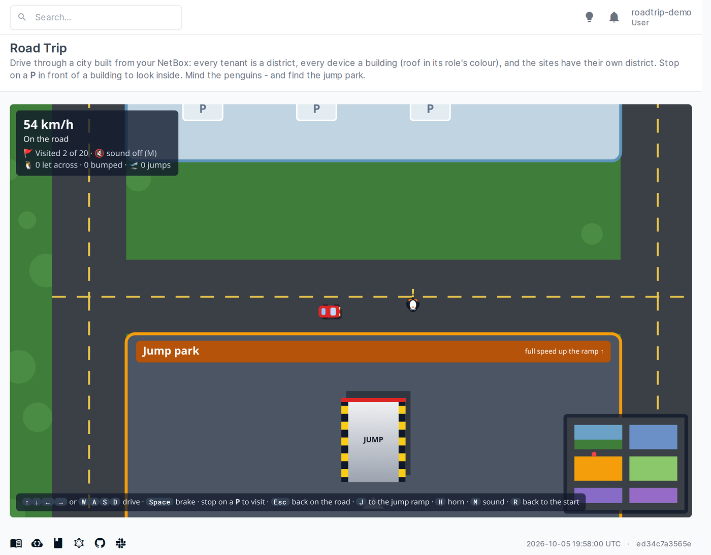
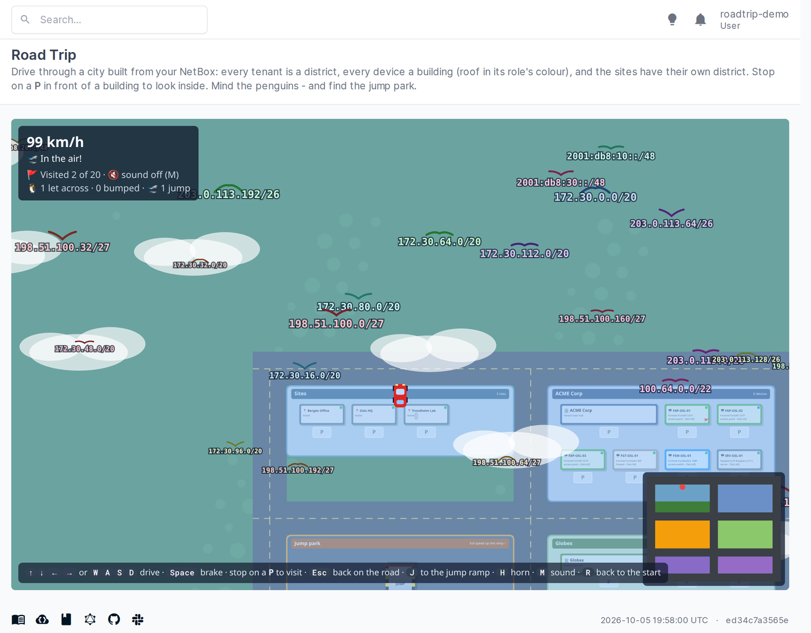
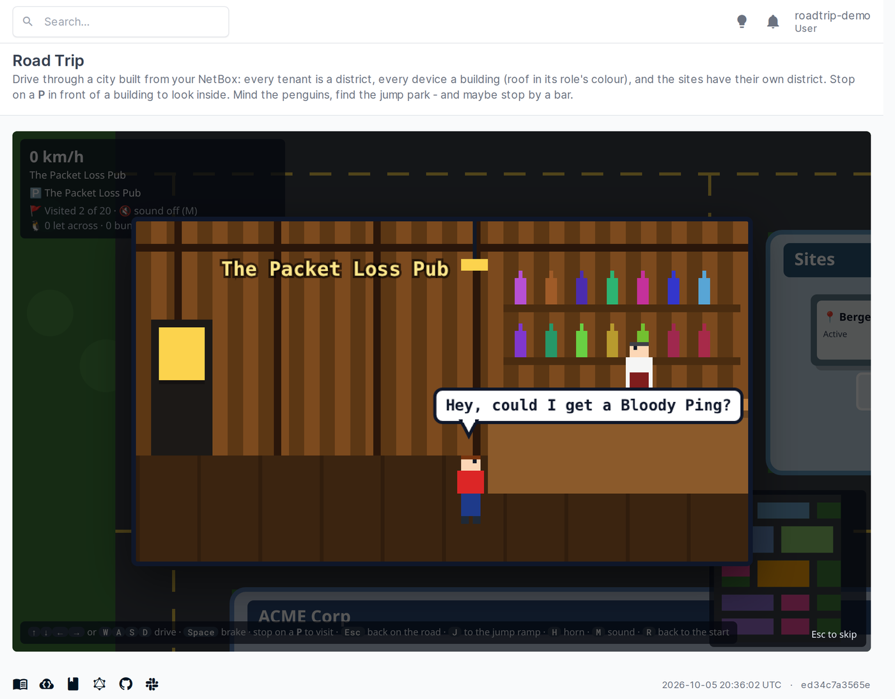
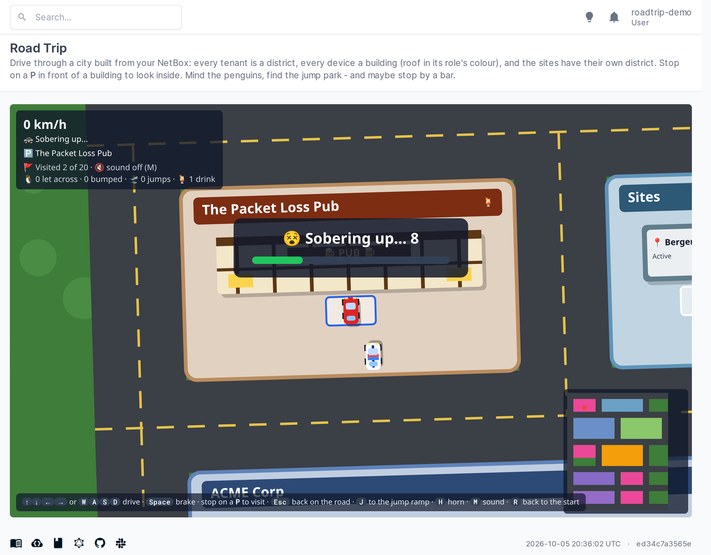

# Road Trip

A [NetBox](https://github.com/netbox-community/netbox) plugin, **just for fun**: drive a little car through a city
built from your NetBox data.


- Every **tenant** is a district, with a town hall and one building per device of that tenant.
- Every **device** is a building: the roof has the colour of the device's role, the light in the corner shows its
  status, and the sign shows its name, type, role, site and primary IP.
- The **sites** have a district of their own; devices without a tenant live in *No tenant*.
- **Stop on the P** in front of a building and the object's NetBox page opens on top of the game. Press **Esc** (or
  *Back on the road*) to drive on, or *Open page* to go there for real.
- Buildings you have visited get a 🚩, and the corner shows how many you have seen (kept in your browser).
- **Penguins** sometimes waddle across the road in front of you (you hear them peep, and a yellow **!** shows when
  you come fast). Brake and let them cross - hit one and your car spins out of control for a moment (the penguin
  is fine, just dizzy 💫). The corner counts penguins let across and bumped.
- The **jump park** in the middle of the city has a ramp: drive up it northwards at full speed and the car soars
  over the map, into a sky full of your NetBox **prefixes** flying around like birds, then lands again (steer a
  little in the air). J takes you to the bottom of the ramp.

<table>
  <tr>
    <td width="50%"></td>
    <td width="50%"></td>
  </tr>
  <tr>
    <td>Brake for the penguin!</td>
    <td>Off the ramp: the city below, prefixes flying like birds</td>
  </tr>
</table>
- **Bars**: 3-4 small bars of different design - a Tudor pub, a neon cocktail bar, a tiki bar, an Irish pub - turn
  up at random places in the city each time you start. Park outside one and a pixel-art scene plays: a guy walks in
  and orders a *Singapore Ping*, a *Mai Ping*, a *Ping and Tonic*, a *Penguin Sunrise*... drinks it, and the window
  closes. When he gets back into the car, a police car arrives with sirens: no driving like that - you wait 10
  seconds to sober up before you can drive on. Esc skips the bar scene (not the wait).

<table>
  <tr>
    <td width="50%"></td>
    <td width="50%"></td>
  </tr>
  <tr>
    <td>"Hey, could I get a Bloody Ping?"</td>
    <td>...and then the police arrive: 10 seconds to sober up</td>
  </tr>
</table>
- **Sound**: the engine follows your speed, the tyres squeal when you brake hard, buildings go *thud*, a parking
  spot beeps and a visit chimes; penguins peep and squawk, the jump whooshes, the wind blows and the prefix birds
  tweet. H is the horn, M turns the sound on and off (remembered in your browser). It is
  all made on the fly with the browser's Web Audio API - no sound files.


Controls: arrow keys or W A S D to drive, Space to brake, J to the jump ramp, H for the horn, M for sound on/off,
R to go back to the start. Roads are fast, the districts
slower, the grass slowest - and the buildings are solid.

It only shows what you are allowed to see, reads nothing it doesn't need, and changes nothing.

## Requirements

NetBox 4.7 or later. No models, no migrations.

## Installation

```
pip install "git+https://github.com/vinceneil666/netbox-plugins.git@roadtrip-v0.3.0#subdirectory=roadtrip"
```

or the wheel attached to the [release](https://github.com/vinceneil666/netbox-plugins/releases/tag/roadtrip-v0.3.0):

```
pip install https://github.com/vinceneil666/netbox-plugins/releases/download/roadtrip-v0.3.0/netbox_roadtrip-0.3.0-py3-none-any.whl
```

Leave out `@roadtrip-v0.3.0` to install the latest code from `main`.

```python
# configuration.py (netbox-docker: configuration/plugins.py)
PLUGINS = ["netbox_roadtrip"]
PLUGINS_CONFIG = {"netbox_roadtrip": {}}
```

Restart NetBox; **Road Trip → Drive** appears in the menu (`/plugins/roadtrip/`).

### Settings

| Setting | Default | |
|---|---|---|
| `max_devices` | `500` | At most this many devices are placed in the city (the first ones by name); the corner says so when some are left out. |
| `max_prefixes` | `150` | At most this many prefixes, picked at random, fly around as birds during a jump. |

For example, in `configuration.py` (netbox-docker: `configuration/plugins.py`):

```python
PLUGINS_CONFIG = {"netbox_roadtrip": {"max_devices": 2000}}
```

Each district is sized for its own buildings (a tenant with many devices gets a wide, square-ish district rather
than a very long one), and only what is on screen is drawn: tested at about 60 frames per second with 2000 devices.

## How it works

The page sends the tenants, sites, devices and a random handful of prefixes the user may view
(`restrict(user, "view")`) as JSON; the city, the car
and the driving are plain JavaScript on a `<canvas>`, no libraries. The object pages open in a same-origin `<iframe>`
with NetBox's menu hidden.

## Changelog

### 0.3.0 (2026-10-05, released: `roadtrip-v0.3.0`)

- Bars: 3-4 bars in four styles at random places; pixel-art bar scene with pun drinks; police arrive afterwards
  and you sober up for 10 seconds (no driving, the world sways). Drinks count in the corner.

### 0.2.0 (2026-10-05, first release: `roadtrip-v0.2.0`)

- Districts sized for their own buildings and packed into rows - no more huge empty districts next to a big one.
- Only what is on screen is drawn, labels are measured once: smooth with thousands of devices.
- Penguins crossing the road: brake for them, or spin out.
- Jump park with a ramp in the middle of the city: fly over the map among your prefixes, as birds (`max_prefixes`).
- J key to the ramp; more sounds (penguins, jump, wind, birds); HUD counts penguins and jumps.

### 0.1.0 (2026-10-05, merged to `main`)

First version: tenant districts, device buildings in role colours, a sites district, parking spots that open the
object's page, visited flags, minimap, sound effects (engine, skid, bump, park, arrival chime, horn; mute with M).
