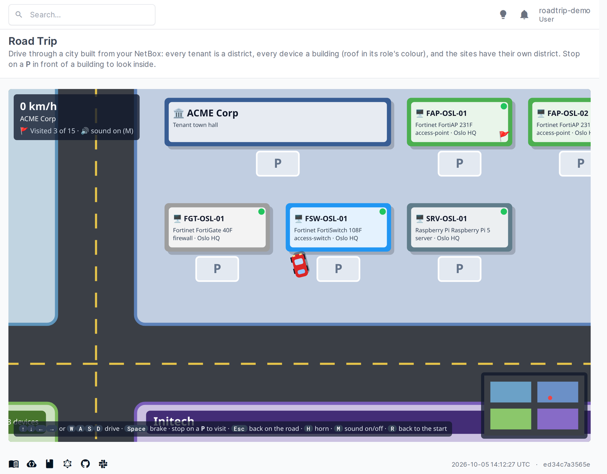
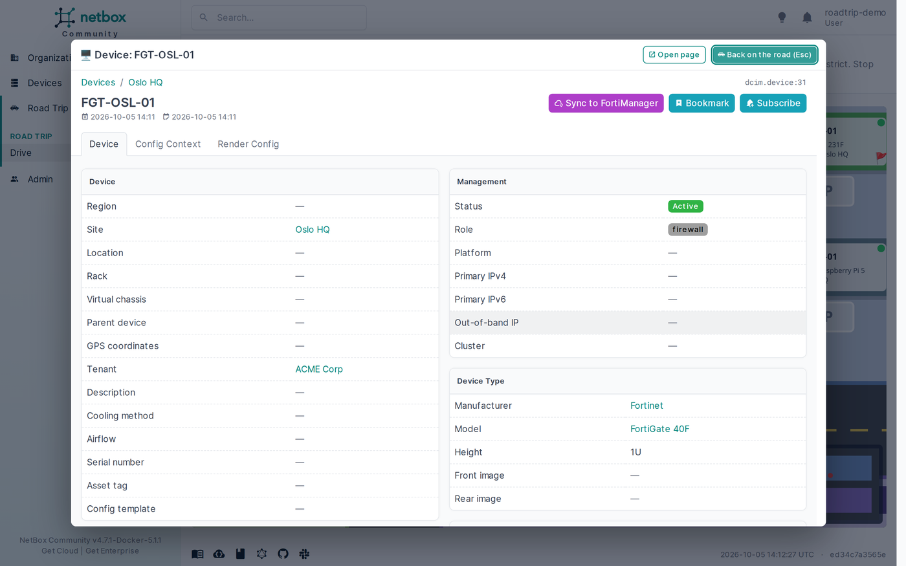

# Road Trip

A [NetBox](https://github.com/netbox-community/netbox) plugin, **just for fun**: drive a little car through a city
built from your NetBox data.



- Every **tenant** is a district, with a town hall and one building per device of that tenant.
- Every **device** is a building: the roof has the colour of the device's role, the light in the corner shows its
  status, and the sign shows its name, type, role, site and primary IP.
- The **sites** have a district of their own; devices without a tenant live in *No tenant*.
- **Stop on the P** in front of a building and the object's NetBox page opens on top of the game. Press **Esc** (or
  *Back on the road*) to drive on, or *Open page* to go there for real.
- Buildings you have visited get a 🚩, and the corner shows how many you have seen (kept in your browser).
- **Sound**: the engine follows your speed, the tyres squeal when you brake hard, buildings go *thud*, a parking
  spot beeps and a visit chimes. H is the horn, M turns the sound on and off (remembered in your browser). It is
  all made on the fly with the browser's Web Audio API - no sound files.



Controls: arrow keys or W A S D to drive, Space to brake, H for the horn, M for sound on/off, R to go back to the
start. Roads are fast, the districts
slower, the grass slowest - and the buildings are solid.

It only shows what you are allowed to see, reads nothing it doesn't need, and changes nothing.

## Requirements

NetBox 4.7 or later. No models, no migrations.

## Installation

```
pip install "git+https://github.com/vinceneil666/netbox-plugins.git#subdirectory=roadtrip"
```

```python
# configuration.py (netbox-docker: configuration/plugins.py)
PLUGINS = ["netbox_roadtrip"]
PLUGINS_CONFIG = {"netbox_roadtrip": {}}
```

Restart NetBox; **Road Trip → Drive** appears in the menu (`/plugins/roadtrip/`).

### Settings

| Setting | Default | |
|---|---|---|
| `max_devices` | `500` | At most this many devices are placed in the city. |

## How it works

The page sends the tenants, sites and devices the user may view (`restrict(user, "view")`) as JSON; the city, the car
and the driving are plain JavaScript on a `<canvas>`, no libraries. The object pages open in a same-origin `<iframe>`
with NetBox's menu hidden.

## Changelog

### 0.1.0 (2026-10-05, merged to `main`, not released)

First version: tenant districts, device buildings in role colours, a sites district, parking spots that open the
object's page, visited flags, minimap, sound effects (engine, skid, bump, park, arrival chime, horn; mute with M).
